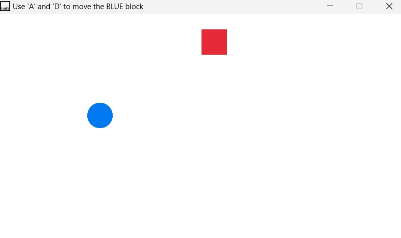

# Blue Block Dodger - Blue Block Dodger is a simple 2D game built using the raylib library. The player controls a blue circle that must avoid colliding with a moving red axe.

## Overview

In this game, the player controls a blue circle using the 'A' and 'D' keys to move left and right. The objective is to avoid being hit by the red axe that moves up and down the screen. If the blue circle collides with the axe, the game ends with a "Game Over" message.

## Features

- Simple and intuitive gameplay
- Collision detection
- Game over condition
- Smooth animations
